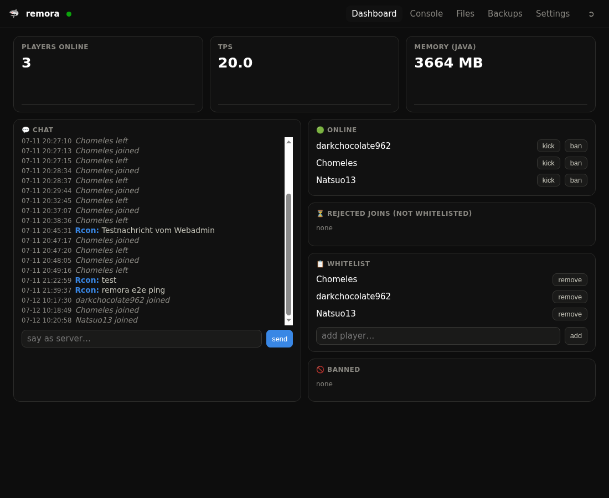

# 🦈 remora

**A single-file, zero-dependency web panel for Minecraft servers.**



Like the remora fish, it attaches to a big animal instead of being one:
remora talks to your **already-running** server through RCON and its log
files. It never owns the java process — so it works with whatever already
runs your server: systemd, screen, tmux, docker, a hosting panel's wrapper.

```
python3 remora.py /path/to/server --port 8765
```

That's the whole install. One file, Python 3.11+ standard library only.

## Where it runs

remora must run **on the same machine as the Minecraft server** — it reads
the server directory, tails the logs and watches the java process. You do
*not* need a second host for it; it idles at ~15 MB RAM next to your server.

- **Your own machine or VPS / root server / Raspberry Pi** — the target. Works.
- **Windows** — works; only the memory tile stays empty (it needs Linux `/proc`).
- **Server in Docker** (e.g. `itzg/minecraft-server`) — run remora on the host,
  point it at the mounted data dir, map the RCON port to `127.0.0.1`.
  The memory tile stays empty.
- **Managed hosting without shell access** (Aternos, Nitrado, Shockbyte, …) —
  not supported. remora needs the server's files; a panel + FTP isn't enough.

## Why

Pterodactyl is a fleet manager (Docker, MySQL, Redis, a daemon). Crafty is an
app. remora is **one Python file** you drop next to your server for the 90%
case: one server, one or two admins, and you want to see and steer what's
happening without SSH.

## Features

- **Live console** — log lines stream in via SSE, run any command
- **Full chat history** — parsed from *rotated* logs too, so it survives
  server restarts; live chat + join/leave feed; talk as the server
- **Player management** — online list, kick / ban / pardon / op,
  whitelist with one click, **rejected-join queue** (players who tried to
  join while not whitelisted — approve or ban them from the panel)
- **Bedrock/Geyser aware** — Floodgate `.name` players are whitelisted
  through `fwhitelist` automatically
- **Metrics** — players, TPS, java memory as 24h sparklines
- **Backups** — world + configs as `.tgz` with `save-off`/`save-all` around
  it, pruning, download, disk-space guard
- **Scheduler** — daily backup / restart / any command at a fixed time
- **File editor** — edit configs in the browser (previous version kept as
  `.bak`), download anything; path-traversal safe
- **Start / stop / restart** — graceful stop via RCON, start via a command
  you configure (e.g. `systemctl start minecraft`)
- **Auth built in** — PBKDF2 password, signed session cookies, login rate
  limiting, Origin checks; or `--no-auth` behind an authenticating proxy

## Setup

1. Enable RCON in `server.properties` (remora reads the password itself):

   ```properties
   enable-rcon=true
   rcon.port=25575
   rcon.password=pick-something-long
   ```

2. Run remora as the same user as the server (it reads the server dir and
   `/proc` of the java process):

   ```
   python3 remora.py /srv/minecraft --port 8765
   ```

   On first start it prints a generated admin password. Change it in
   Settings, or set your own: `python3 remora.py /srv/minecraft --set-password`

3. Optional systemd unit:

   ```ini
   [Unit]
   Description=remora MC panel
   After=network.target

   [Service]
   User=minecraft
   ExecStart=/usr/bin/python3 /opt/remora/remora.py /srv/minecraft --port 8765
   Restart=on-failure

   [Install]
   WantedBy=multi-user.target
   ```

## Security notes

- remora binds to `127.0.0.1` by default. To expose it, put a TLS reverse
  proxy in front (Caddy/nginx). All URLs are relative, so serving it under a
  sub-path (`/mc/`) works out of the box — strip the prefix in your proxy.
- The panel is an **admin** tool: a logged-in user has full RCON and can edit
  server files. Don't hand out the password to non-admins.
- `--no-auth` disables the built-in login entirely — only use it when your
  reverse proxy already authenticates every request.
- State (password hash, session secret, schedules) lives in
  `remora.json` in the server dir, mode 0600, and is hidden from the
  panel's own file manager.

## Restore a backup

```
# stop the server first, then:
tar xzf backups/backup-YYYYMMDD-HHMMSS.tgz -C /path/to/server
```

## Development

`python3 test_remora.py` runs the self-checks (parser, auth, path safety,
RCON framing). The whole panel is ~1200 lines in one file — read it.

## License

MIT

## Author

Built by [Sharko IT-Services](https://sharko.icu) — custom websites & fullstack web apps from Hamburg.
